# numba-stats


We provide `numba`-accelerated implementations of statistical functions for common probability distributions

* Uniform
* (Truncated) Normal
* Log-normal
* Poisson
* (Truncated) Exponential
* Student's t
* Voigtian
* Crystal Ball
* Generalised double-sided Crystal Ball
* Tsallis-Hagedorn, a model for the minimum bias pT distribution
* Q-Gaussian
* Bernstein density (not normalized to unity, use this in extended likelihood fits)
* Cruijff density (not normalized to unity, use this in extended likelihood fits)

with more to come. The speed gains are huge, up to a factor of 100 compared to `scipy`. Benchmarks are included in the repository and are run by `pytest`.

## Usage

Each distribution is implemented in a submodule. Import the submodule that you need.
```py
from numba_stats import norm
import numpy as np

x = np.linspace(-10, 10)
mu = 2
sigma = 3

p = norm.pdf(x, mu, sigma)
c = norm.cdf(x, mu, sigma)
```
The functions are vectorized on the variate `x`, but not on the shape parameters of the distribution. Ideally, the following functions are implemented for each distribution:
* `logpdf`
* `pdf`
* `cdf`
* `ppf`

`cdf` and `ppf` are missing for some distributions (e.g. `voigt`), if there is currently no fast implementation available. `logpdf` is only implemented if it is more efficient and accurate compared to computing `log(dist.pdf(...))`.

The distributions in `numba_stats` can be used in other `numba`-JIT'ed functions. The functions in `numba_stats` use a single thread, but the implementations were written so that they profit from auto-parallelization. To enable this, call them from a JIT'ed function with the argument `parallel=True,fastmath=True`. You should always combine `parallel=True` with `fastmath=True`, since the latter enhances the gain from auto-parallelization.

```py
from numba_stats import norm
import numba as nb
import numpy as np

@nb.njit(parallel=True, fastmath=True)
def norm_pdf(x, mu, sigma):
  return norm.pdf(x, mu, sigma)

x = np.linspace(-10, 10)
mu = 2
sigma = 3

# uses all your CPU cores
p = norm_pdf(x, mu, sigma)
```

Note that this is only faster if `x` has sufficient length (about 1000 elements or more). Otherwise, the parallelization overhead will make the call slower, see benchmarks below.

## Benchmarks

The following benchmarks were produced on an Intel(R) Core(TM) i7-8569U CPU @ 2.80GHz against SciPy-1.10.1. The dotted line on the right-hand figure shows the expected speedup (4x) from parallelization on a CPU with four physical cores.

We see large speed-ups with respect to `scipy` for almost all distributions. Also calls with short arrays profit from `numba_stats`, due to the reduced call-overhead. The functions `voigt.pdf` and `t.ppf` do not run faster than the `scipy` versions, because we call the respective `scipy` implementation written in FORTRAN. The advantage provided by `numba_stats` here is that you can call these functions from other `numba`-JIT'ed functions, which is not possible with the `scipy` implementations, and `voigt.pdf` still profits from auto-parallelization.

The `bernstein.density` does not profit from auto-parallelization, on the contrary it becomes much slower, so this should be avoided. This is a known issue, the internal implementation cannot be easily auto-parallelized.


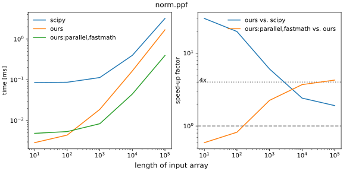
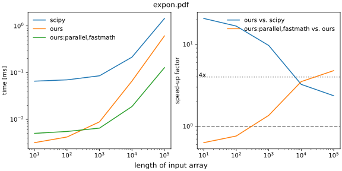
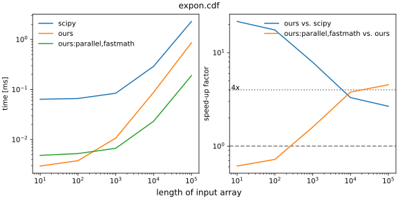

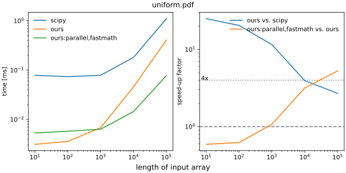
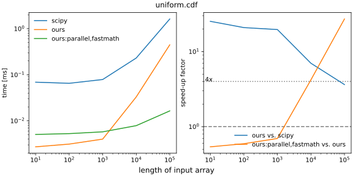
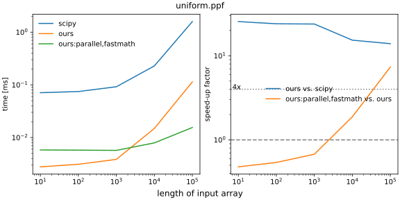
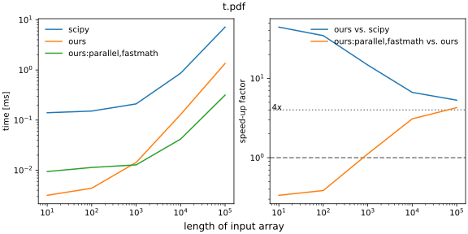
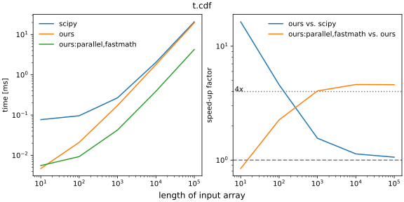


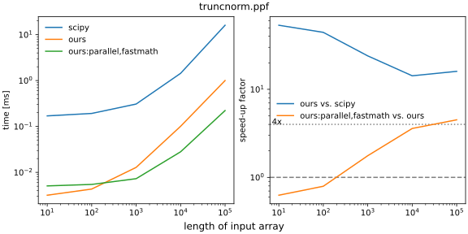
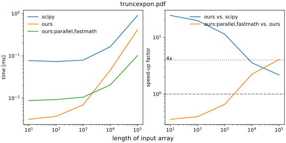
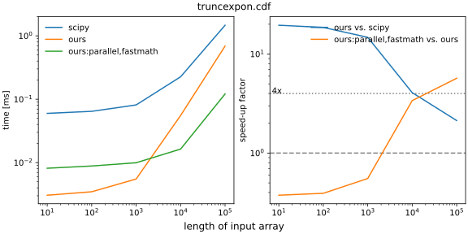

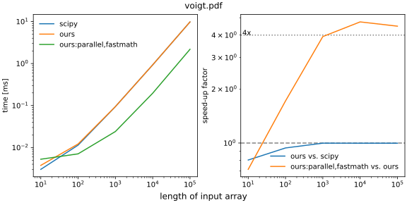
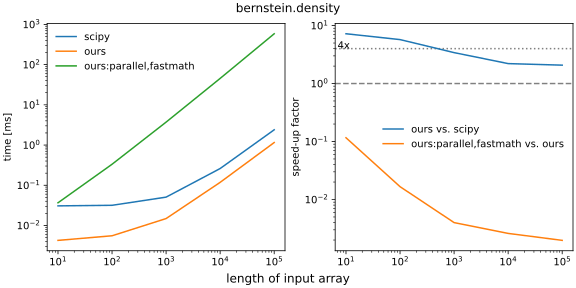


## Documentation

To get documentation, please use `help()` in the Python interpreter.

Functions with equivalents in `scipy.stats` follow the `scipy` calling conventions exactly, except for distributions starting with `trunc...`, which follow a different convention, since the `scipy` behavior is very impractical. Even so, note that the `scipy` conventions are sometimes a bit unusual, particular in case of the exponential, the log-normal, and the uniform distribution. See the `scipy` docs for details.

## Contributions

**You can help with adding more distributions, patches are very welcome.** Implementing a probability distribution is easy. You need to write it in simple Python that `numba` can understand. Special functions from `scipy.special` can be used after some wrapping, see submodule `numba_stats._special.py` how it is done.

## numba-stats and numba-scipy

[numba-scipy](https://github.com/numba/numba-scipy) is the official package and repository for fast numba-accelerated scipy functions, are we reinventing the wheel?

Ideally, the functionality in this package should be in `numba-scipy` and we hope that eventually this will be case. In this package, we don't offer overloads for scipy functions and classes like `numba-scipy` does. This simplifies the implementation dramatically. `numba-stats` is intended as a temporary solution until fast statistical functions are included in `numba-scipy`. `numba-stats` currently does not depend on `numba-scipy`, only on `numba` and `scipy`.
